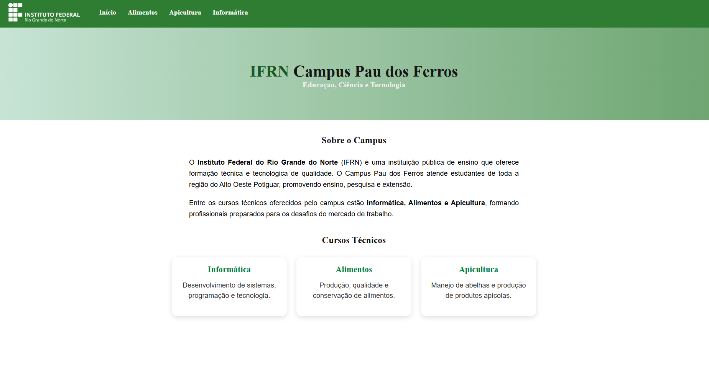
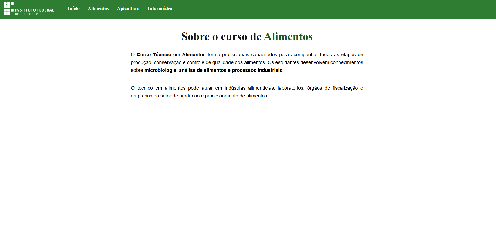
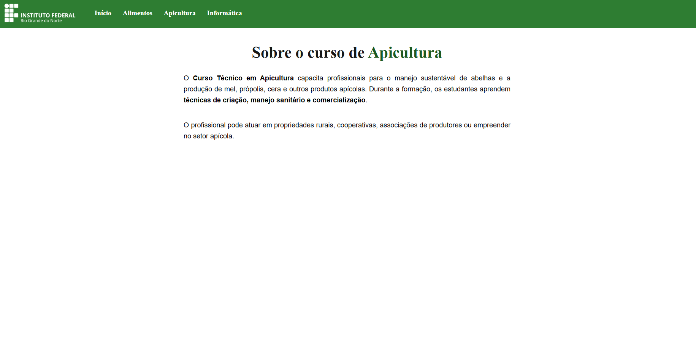
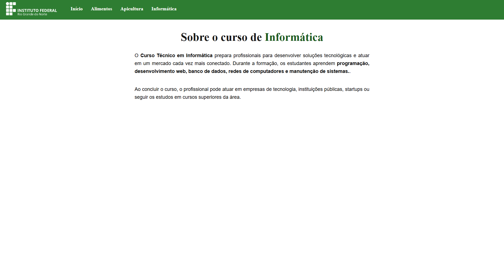
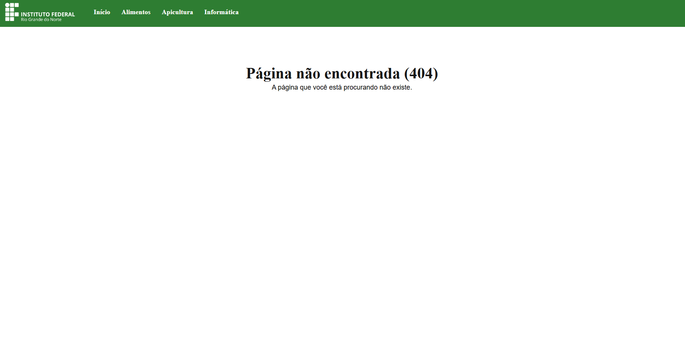

# ✦ Site dos Cursos do IFRN ✦

Projeto desenvolvido para a disciplina de **Programação para Internet**.

A aplicação apresenta informações sobre os cursos técnicos oferecidos pelo IFRN Campus Pau dos Ferros, utilizando **React Router** para realizar a navegação entre páginas sem recarregamento da aplicação.

---

## ✧ Tecnologias Utilizadas

- React
- React Router DOM
- JavaScript
- CSS
- Vite

---

## ✧ Screenshots

### Página Inicial



### Curso de Alimentos



### Curso de Apicultura



### Curso de Informática



### Página Não Encontrada (404)



---

## ✧ Funcionalidades

- Navegação entre páginas utilizando `React Router`
- Menu de navegação presente em todas as páginas
- Uso de componentes reutilizáveis
- Página inicial institucional
- Páginas individuais para cada curso
- Página de erro para rotas inexistentes (404)
- Interface **bem simples** estilizada com CSS

---

## ✧ Estrutura do Projeto

```text
src/
├── components/
│   ├── Menu.jsx
│   └── CardCurso.jsx
├── pages/
│   ├── Inicio.jsx
│   ├── Informatica.jsx
│   ├── Alimentos.jsx
│   ├── Apicultura.jsx
│   └── NaoEncontrada.jsx
├── assets/
├── App.jsx
├── main.jsx
└── index.css
```

---

## ✧ Como Executar o Projeto

Clone o repositório:

```bash
git clone URL_DO_REPOSITORIO
```

Acesse a pasta do projeto:

```bash
cd cursos-ifpdf
```

Instale as dependências:

```bash
npm install
```

Execute o projeto:

```bash
npm run dev
```

---

## ✧ Rotas Disponíveis

```text
/
```

Página inicial do IFRN Campus Pau dos Ferros.

```text
/alimentos
```

Página do Curso Técnico em Alimentos.

```text
/apicultura
```

Página do Curso Técnico em Apicultura.

```text
/informatica
```

Página do Curso Técnico em Informática.

```text
*
```

Página de erro 404 para endereços inexistentes.

---

